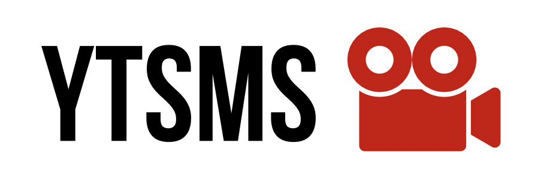

<p align="center">
  
</p>
<p align="center">
  

</p>

<p align="center"><i><b>[Still under "initial" development, some features may be unstable or change in the future, although database schemas should be stable. A first release version is planned to be packed soon].</b></i></p>
<p align="center">YTSMS is a <b>self-hosted youtube subscription management service.</b><br>Useful to keep track of new uploaded video of the followed channels, even without having a Google account.</p>

<p align="center"><a href="https://github.com/MDeLuise/ytsms/#why">Why?</a> • <a href="https://github.com/MDeLuise/ytsms/#features-highlight">Features highlights</a> • <a href="https://github.com/MDeLuise/ytsms/#getting-started">Quickstart</a> • <a href="https://github.com/MDeLuise/ytsms/#configuration">Configuration</a> • <a href="https://github.com/MDeLuise/ytsms/#faq">FAQ</a> • <a href="https://github.com/MDeLuise/ytsms/#contribute">Contribute</a></p>

<p align="center">
  
   
</p>

## Why?
I've always enjoyed spending some time viewing YouTube videos. The problem is that YouTube keeps track of a lot of data about you.

Ytsms takes care of this problem allowing you to get updated about new videos from followed channels without having a Google account or having it but using the official API (that is still better then using directly the subscription system of the Google account, since you can view the video logged out).

## Features highlight
* Add channels to followed list
* Get notified about every new video published by the followed channels
* Filter videos by channel
* Chose between YouTube backend or an [Invidious](https://invidious.io/) instance
* Dark/Light mode
* 🔜 Create playlists of videos

### Quickstart 
Installing ytsms is pretty straight forward, in order to do so follow these steps:
1. Create a folder where you want to place all ytsms related files.
1. Inside that folder, create the following files:
    * `docker-compose.yml`:
    ```yaml
    version: "3"
    name: ytsms
    services:
      backend:
        image: msdeluise/ytsms-backend:latest
        env_file: backend.env
        depends_on:
          - db
        restart: unless-stopped
        volumes:
          - "certs:/certificates"
        ports:
          - "8080:8080"

      db:
        image: mysql:8.0
        restart: always
        env_file: backend.env
        volumes:
          - "./db:/var/lib/mysql"

      frontend:
        image: msdeluise/ytsms-frontend:latest
        env_file: frontend.env
        links:
          - backend
        ports:
          - "3000:3000"
        volumes:
          - "certs:/certificates"
    volumes:
      certs:
        driver: local
        driver_opts:
          type: none
          o: bind
          device: ./certificates
    ```
    * `backend.env`:
    ```properties
    #
    # DB
    #
    MYSQL_HOST=db
    MYSQL_PORT=3306
    MYSQL_USERNAME=root
    MYSQL_PSW=root
    MYSQL_ROOT_PASSWORD=root
    MYSQL_DATABASE=bootdb
    
    #
    # JWT
    #
    JWT_SECRET=putTheSecretHere
    JWT_EXP=1
    
    #
    # Server config
    #
    USERS_LIMIT=-1 # <= 0 means no limit
    YOUTUBE_KEY=
    VIDEO_REFRESH=0 0 * * * *

    #
    # SSL
    #
    SSL_ENABLED=false
    CERTIFICATE_PATH=/certificates/
    ```
    * `frontend.env`:
    ```properties
    PORT=3000
    API_URL=http://localhost:8080/api
    WAIT_TIMEOUT=10000
    BROWSER=none
    SSL_ENABLED=false
    CERTIFICATE_PATH=/certificates/
    ```
1. Run the docker compose file (`docker compose -f docker-compose.yml up -d`), then the service will be available at `localhost:3000`, while the REST API will be available at `localhost:8080/api` (`localhost:8080/api/swagger-ui/index.html` for the documentation of them).

Run the docker compose file (`docker compose -f <file> up -d`), then the service will be available at `localhost:8080`, while the REST API will be available at `localhost:8080/api` (`localhost:8080/api/swagger-ui/index.html` for the documentation of them).

<details>

  <summary>Run on a remote host (e.g. from mobile)</summary>

  Please notice that running the `docker-compose` file from another machine change the way to connect to the server. For example, if you run the `docker-compose` on the machine with the local IP `192.168.1.100` then you have to change the backend url in the `API_URL` variable to `192.168.1.100:8080/api`. In this case, the frontend of the system will be available at `192.168.1.100:8080`, and the backend will be available at `192.168.1.100:8080/api`.
</details>


### Fetching mode
The service offers two video retrieval options:
* `scraping`: videos are retrieved without the need of a YouTube API key, although there are [some restrictions](#FAQ)
* `official YouTube api`: video are retrieved using a YouTube API key, which means [more metadata can be fetched but less anonymization is provided](#FAQ) 

In order to choose between one of the retrieval option, the `YOUTUBE_KEY` property in the [configuration file](#Configuration) must be filled or left empty. 

## FAQ
* How can I get the `channel id` of a youtube channel?
  
  You can do it in two ways:
  * go to the channel homepage and run in the javascript console `ytInitialData.metadata.channelMetadataRenderer.externalId`
  * go to the channel homepage, view the page source and search for the value `browse_id`

* What distinguishes `official youtube api` and `scraping` modes?
  
  The `official youtube api` mode offers the following advantages:
  * retrieve the video duration
  * retrieve the channels image thumbnails
  * retrieve more old video
  
  The `scraping` mode offers the following advantages:
  * no need to use any YouTube API key
  * no [quota restrictions](https://developers.google.com/youtube/v3/getting-started#quota)
  * increased anonymization

* How can I create a YouTube API key?

  You can create a key following the [official guide](https://developers.google.com/youtube/v3/getting-started).

* Why sometime the `Channel Name` method for adding a subscription does not works?

  This is a pretty known problem ([1](https://stackoverflow.com/questions/71062188/youtube-listchannels-with-usernameforusername-is-not-working), [2](https://stackoverflow.com/questions/35051882/youtube-api-v3-channels-list-method-doesnt-work-for-some-channels-names), [3](https://stackoverflow.com/questions/39378768/youtube-api-3-channels-by-username-and-id-inconsistant), [4](https://stackoverflow.com/questions/64299967/how-to-find-the-forusername-parameter-for-a-specific-channel)). It's caused by the inconsistence of some YouTube channel's `custom URL` and `username` parameters.

## Contribute
Feel free to contribute and help improve the repo.

### Bug Report, Feature Request and Question
You can submit any of this in the [issues](https://github.com/MDeLuise/ytsms/issues/new/choose) section of the repository. Chose the right template and then fill the required info.

### Bug fix
If you fix a bug, please follow the [contribution-guideline](https://github.com/MDeLuise/ytsms# contribution-guideline) in order to merge the fix in the repository.

### Feature development
Let's discuss first possible solutions for the development before start working on that, please open a [feature request issue](https://github.com/MDeLuise/ytsms/issues/new?assignees=&labels=&projects=&template=fr.yml).

### Contribution guideline
To fix a bug or create a feature, follow these steps:
1. Fork the repo
1. Create a new branch (`git checkout -b awesome-feature`)
1. Make changes or add new changes.
1. Commit your changes (`git add -A; git commit -m 'Awesome new feature'`)
1. Push to the branch (`git push origin awesome-feature`)
1. Create a Pull Request

#### Conventions
* Commits should follow the [semantic commit](https://www.conventionalcommits.org/en/v1.0.0/) specification, although not mandatory.
