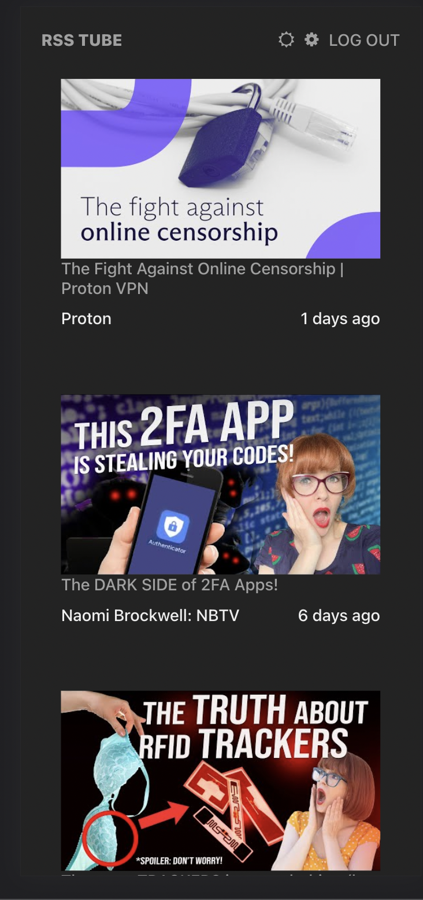
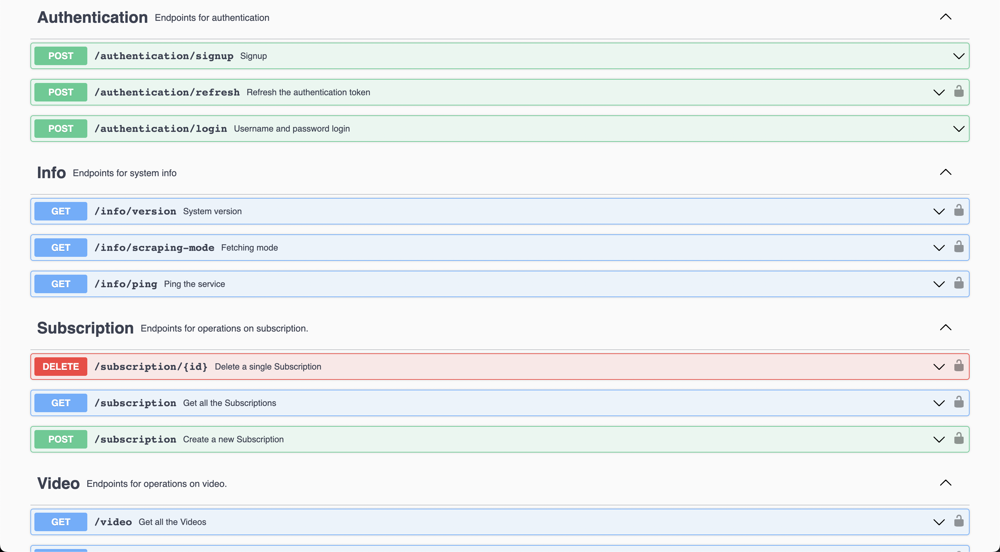

# Youtube Subscription Management Service


Desktop view                              | Mobile view
:----------------------------------------:|:---------------------------------------:
  |  

Youtube Subscription Management Service is a very creatively named service that offers the ability to manage YouTube channel subscriptions without the need for a Google account.

# Why ytsms?
Ytsms can be used to subscribe to a YouTube channel without setting up a Google account. It maintains track of every new video that is uploaded by the channels that are followed, and clicking on the video thumbnails plays the selected video in YouTube or in a Invidious instance.

# Prerequisite
In order to make the service works the following are needed.

## Snapshot version
If you want to use the snapshot version (i.e. simply use the service from the `main` branch):
* [JDK 19+](https://openjdk.org/)
* [MySQL](https://www.mysql.com/) (required for the production environment)
* [React](https://reactjs.org/)

### Release version
If you want to use the release version (i.e. simply use the service from one of the `vX.X.X` tags):
* [Docker](https://www.docker.com/)

# How to run

### Snapshot version
* If you want to use the produciton environment, be sure to have the `mysql` database up and running
* Run the following command in the terminal inside the `backend` folder
  `./mvnw spring-boot:run`, or if don't want to use the production environment (i.e you prefer to use the embedded H2 database) you can append `-Dspring-boot.run.profiles=dev` to the command
* Run the following command in the terminal inside the `frontend` folder
  `npm start`

Then, the frontend of the system will be available at `http://localhost:3000`, and the backend at `http://localhost:8085/api`.

### Release version
In order to use the relase version of the service, 2 docker images are provided:
* `msdeluise/ytsms-backend`
* `msdeluise/ytsms-frontend`

This images can be use indipendently, or they can be use in a `docker-compose` file.
One example of working docker-compose is provided at `deployment/docker-compose.yml`, it can be use running `docker-compose -f deployment/docker-compose.yml up -d` from the project root.
In this case, the frontend of the system will be available at `http:localhosto:8080`, and the backend will be available at `http://localhost:8080/api`.

# Fetching mode
The service offers two video retrieval options:
* `scraping`: videos are retrieved without the need of a YouTube API key, although there are [some restrictions](#FAQ)
* `official YouTube api`: video are retrieved using a YouTube API key, which means [more metadata can be fetched but less anonymization is provided](#FAQ) 

In order to choose between one of the retrieval option, the `YOUTUBE_KEY` property in the [configuration file](#Configuration) must be filled or left empty. 
 
# Configuration
There are 2 configuration file available:
* `deployment/backend.env`: file containing the configuration for the backend. An example of content is the following:
  ```
  MYSQL_HOST=db
  MYSQL_PORT=3306
  MYSQL_USERNAME=root
  MYSQL_PSW=root
  JWT_SECRET=putTheSecretHere
  JWT_EXP=1
  MYSQL_ROOT_PASSWORD=root
  MYSQL_DATABASE=bootdb
  USERS_LIMIT=-1 # including the admin account, so <= 0 if undefined, >= 2 if defined
  YOUTUBE_KEY=
  VIDEO_REFRESH=0 0 * * * *
  ```
  Change the properties values according to your system.

* `deployment/frontend.env`: file containing the configuration for the frontend. An example of content is the following:
  ```
  REACT_APP_API_URL=http://localhost:8080/api
  BROWSER=none
  REACT_APP_PAGE_SIZE=25
  ```
  Change the properties values according to your system.

# Documentation
After a successful [run](#how-to-run) of the system, the swagger UI will be available at `http://localhost:8085/api/swagger-ui/index.html`


# FAQ
* How can I get the `channel id` of a youtube channel?
  
  You can do it in two ways:
  * go to the channel homepage and run in the javascript console `ytInitialData.metadata.channelMetadataRenderer.externalId`
  * go to the channel homepage, view the page source and search for the value `browse_id`

* What distinguishes `official youtube api` and `scraping` modes?
  
  The `official youtube api` mode offers the following advantages:
  * retrieve the video duration
  * retrieve the channels image thumbnails
  * retrieve more old video
  
  The `scraping` mode offers the following advantages:
  * no need to use any YouTube API key
  * no [quota restrictions](https://developers.google.com/youtube/v3/getting-started#quota)
  * increased anonymization

* How can I create a YouTube API key?

  You can create a key following the [official guide](https://developers.google.com/youtube/v3/getting-started).

# Contributing
Fell free to contribute! Just a few useful information below.

This project use the Trunk-Based Development as source-control branching model. The usual workflow for contributing is the following:
1. create a new branch starting from `main` branch,
1. work on that,
1. create a pull request to merge the branch in the `main`.
Once the pull request is approved, please rebase the branch upon `main`. Once the pull request will be accepted, the commits will be squashed using the pull request's description, so please provide a meaningful description message.
